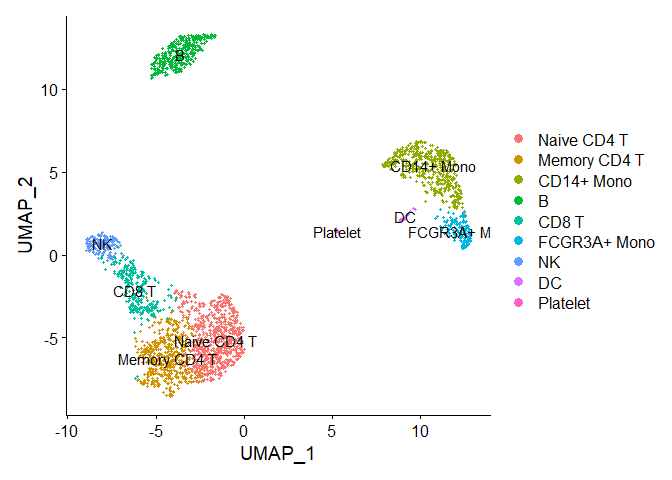
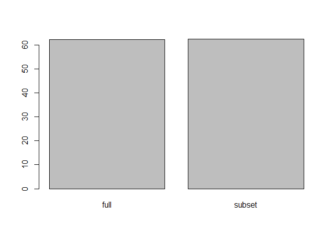

``` r
suppressWarnings(library(Seurat))
```

    ## Registered S3 method overwritten by 'spatstat.geom':
    ##   method     from
    ##   print.boxx cli

    ## Attaching SeuratObject

``` r
suppressWarnings(library(SeuratData))
```

    ## -- Installed datasets ------------------------------------- SeuratData v0.2.1 --

    ## v ifnb   3.1.0                          v pbmc3k 3.1.4

    ## -------------------------------------- Key -------------------------------------

    ## v Dataset loaded successfully
    ## > Dataset built with a newer version of Seurat than installed
    ## (?) Unknown version of Seurat installed

``` r
pbmc <- suppressWarnings(LoadData("pbmc3k", type = "pbmc3k.final"))

DimPlot(pbmc, reduction = "umap",label = TRUE)
```

<!-- -->

``` r
# list options for groups to perform differential expression on
levels(pbmc)
```

    ## [1] "Naive CD4 T"  "Memory CD4 T" "CD14+ Mono"   "B"            "CD8 T"       
    ## [6] "FCGR3A+ Mono" "NK"           "DC"           "Platelet"

``` r
## [1] "Naive CD4 T"  "Memory CD4 T" "CD14+ Mono"   "B"            "CD8 T"       
## [6] "FCGR3A+ Mono" "NK"           "DC"           "Platelet"
```

# Subseting based on the clustering

you can subset on mulitiple data wihtin the seurat object

-   Subset Seurat object based on identity class, also see ?SubsetData
    subset(x = pbmc, idents = “B cells”) subset(x = pbmc, idents =
    c(“CD4 T cells”, “CD8 T cells”), invert = TRUE)

-   Subset on the expression level of a gene/feature subset(x = pbmc,
    subset = MS4A1 &gt; 3)

-   Subset on a combination of criteria subset(x = pbmc, subset =
    MS4A1 &gt; 3 & PC1 &gt; 5) subset(x = pbmc, subset = MS4A1 &gt; 3,
    idents = “B cells”)

-   Subset on a value in the object meta data subset(x = pbmc, subset =
    orig.ident == “Replicate1”)

-   Downsample the number of cells per identity class subset(x = pbmc,
    downsample = 100)

``` r
CD14_pbmc <- subset(x = pbmc, idents = c("CD14+ Mono", "FCGR3A+ Mono"))

monocyte.de.markers.small <- FindMarkers(CD14_pbmc, ident.1 = "CD14+ Mono", ident.2 = "FCGR3A+ Mono")
```

``` r
# Find differentially expressed features between CD14+ and FCGR3A+ Monocytes
monocyte.de.markers <- FindMarkers(pbmc, ident.1 = "CD14+ Mono", ident.2 = "FCGR3A+ Mono")
# view results
head(monocyte.de.markers)
```

    ##                p_val avg_log2FC pct.1 pct.2    p_val_adj
    ## FCGR3A 1.193617e-101  -3.776553 0.131 0.975 1.636926e-97
    ## LYZ     8.134552e-75   2.614275 1.000 0.988 1.115572e-70
    ## RHOC    4.479768e-68  -2.325013 0.162 0.864 6.143554e-64
    ## S100A8  7.471811e-65   3.766437 0.975 0.500 1.024684e-60
    ## S100A9  1.318422e-64   3.299060 0.996 0.870 1.808084e-60
    ## IFITM2  4.821669e-64  -2.085807 0.677 1.000 6.612437e-60

``` r
# Find differentially expressed features between CD14+ Monocytes and all other cells, only
# search for positive markers
monocyte.de.markers <- FindMarkers(pbmc, ident.1 = "CD14+ Mono", ident.2 = NULL, only.pos = TRUE)
# view results
head(monocyte.de.markers)
```

    ##                p_val avg_log2FC pct.1 pct.2     p_val_adj
    ## S100A9  0.000000e+00   5.570063 0.996 0.215  0.000000e+00
    ## S100A8  0.000000e+00   5.477394 0.975 0.121  0.000000e+00
    ## FCN1    0.000000e+00   3.394219 0.952 0.151  0.000000e+00
    ## LGALS2  0.000000e+00   3.800484 0.908 0.059  0.000000e+00
    ## CD14   2.856582e-294   2.815626 0.667 0.028 3.917516e-290
    ## TYROBP 3.190467e-284   3.046798 0.994 0.265 4.375406e-280

# Check for System Time (Speed of Execution)

``` r
system.time(FindMarkers(pbmc, ident.1 = "CD14+ Mono", ident.2 = "FCGR3A+ Mono", max.cells.per.ident = 500))
```

    ##    user  system elapsed 
    ##    3.59    0.02    3.68

``` r
system.time(FindMarkers(CD14_pbmc, ident.1 = "CD14+ Mono", ident.2 = "FCGR3A+ Mono", max.cells.per.ident = 500))
```

    ##    user  system elapsed 
    ##    3.76    0.01    3.94

``` r
system.time(FindMarkers(pbmc, ident.1 = "CD14+ Mono", ident.2 = "FCGR3A+ Mono", test.use = "DESeq2", max.cells.per.ident = 500))
```

    ## converting counts to integer mode

    ## gene-wise dispersion estimates

    ## mean-dispersion relationship

    ## final dispersion estimates

    ##    user  system elapsed 
    ##   66.94    1.61   71.28

``` r
system.time(FindMarkers(CD14_pbmc, ident.1 = "CD14+ Mono", ident.2 = "FCGR3A+ Mono", test.use = "DESeq2", max.cells.per.ident = 500))
```

    ## converting counts to integer mode

    ## gene-wise dispersion estimates

    ## mean-dispersion relationship

    ## final dispersion estimates

    ##    user  system elapsed 
    ##   61.94    0.63   68.89

``` r
time1 <- system.time(FindMarkers(pbmc, ident.1 = "CD14+ Mono", ident.2 = "FCGR3A+ Mono", test.use = "DESeq2", max.cells.per.ident = 500))
```

    ## converting counts to integer mode

    ## gene-wise dispersion estimates

    ## mean-dispersion relationship

    ## final dispersion estimates

``` r
time2 <- system.time(FindMarkers(CD14_pbmc, ident.1 = "CD14+ Mono", ident.2 = "FCGR3A+ Mono", test.use = "DESeq2", max.cells.per.ident = 500))
```

    ## converting counts to integer mode

    ## gene-wise dispersion estimates

    ## mean-dispersion relationship

    ## final dispersion estimates

``` r
speed_df <- c(time1[3],time2[3])
names(speed_df) <- c("full","subset")

barplot(speed_df)
```

<!-- -->
